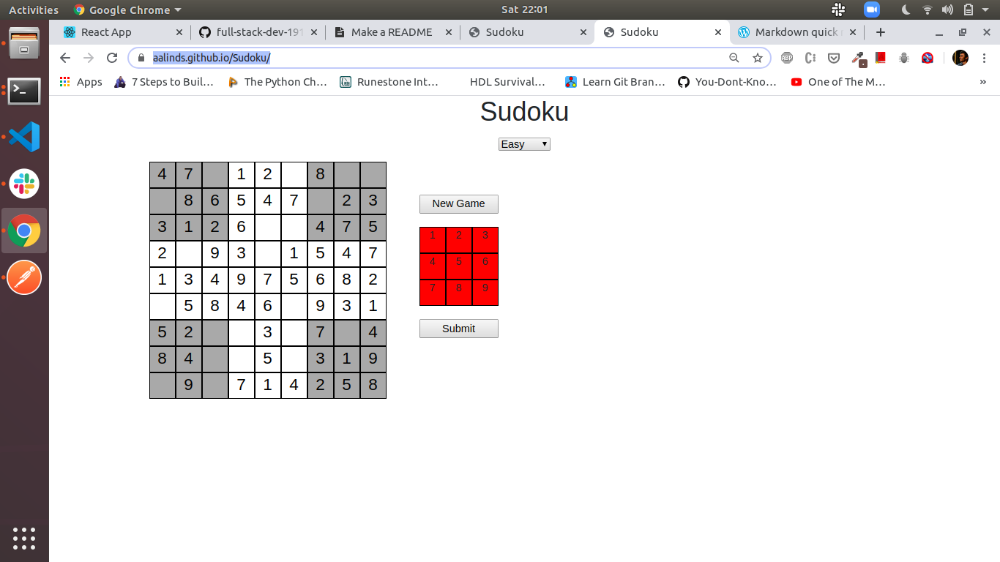
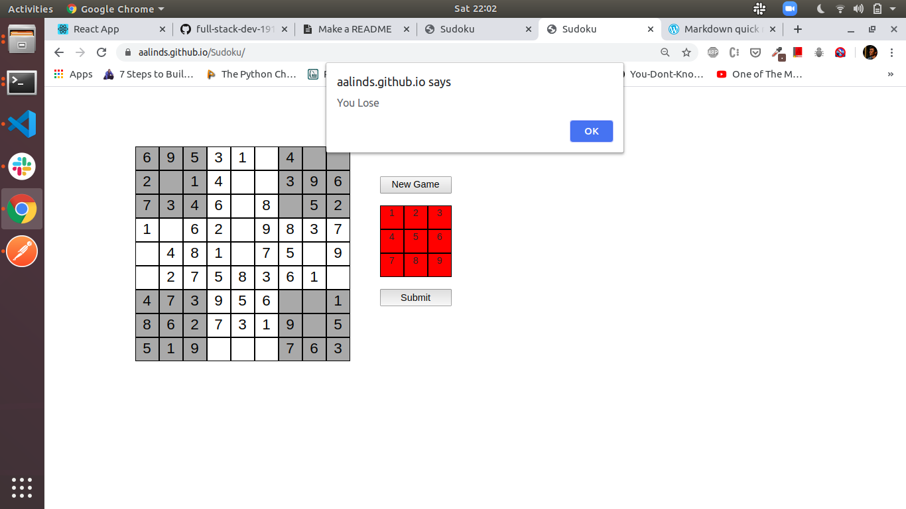
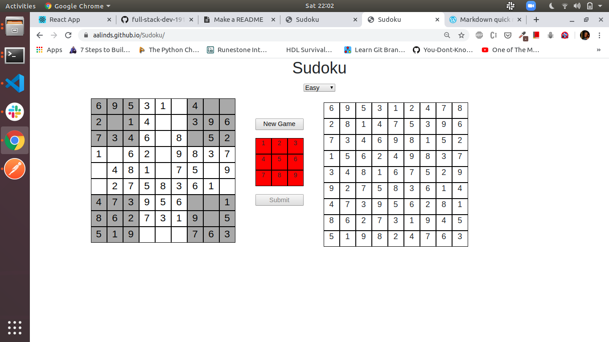

# Sudoku

Sudoku game is built using HTML, CSS & JavaScript

## About

- This game has been built using HTML5, CSS3 & JavaScript.
- A new Sudoku grid is generated every time a new game is started.
- Sudoku Solver and Sudoku Generator algorithms are used to generate new grids.
- Sudoku Solver algorithm uses Backtracking technique to solve the puzzle. Algorithm gives all possible grids for a given puzzle.
- Sudoku Generator algorithm uses above mentioned Sudoku Solver algorithm to make sure that the generated Sudoku grid is valid (i.e. it has only one possible solution).

## Play online

https://aalinds.github.io/Sudoku/

## Installation

1. Clone this repo on your local system
2. Open `index.html` file in the repo
3. Start playing

## How to play

- The goal of Sudoku is to fill in a 9×9 grid with digits so that each column, row, and 3×3 section contain the numbers between 1 to 9. At the beginning of the game, the 9×9 grid will have some of the squares filled in. Your job is to use logic to fill in the missing digits and complete the grid. Don’t forget, a move is incorrect if:

  - Any row contains more than one of the same number from 1 to 9
  - Any column contains more than one of the same number from 1 to 9
  - Any 3×3 grid contains more than one of the same number from 1 to 9

- Double click on number in the 9x9 grid to delete it.

## Game images

